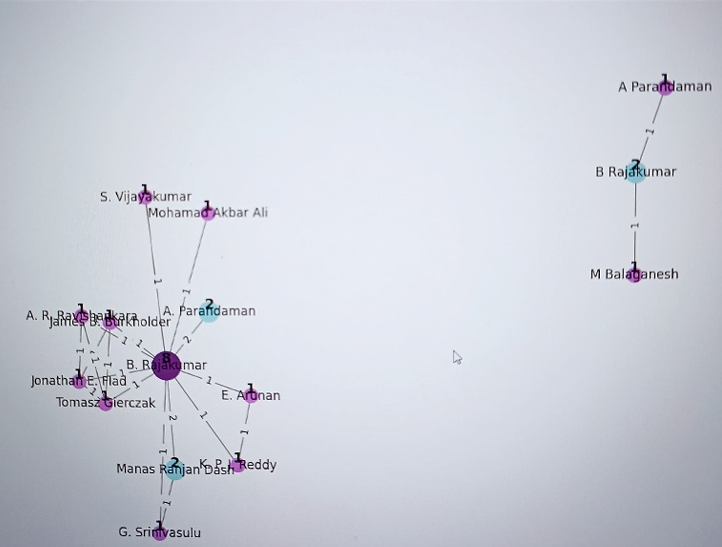
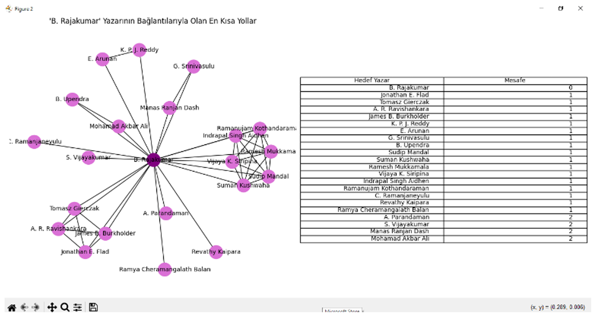
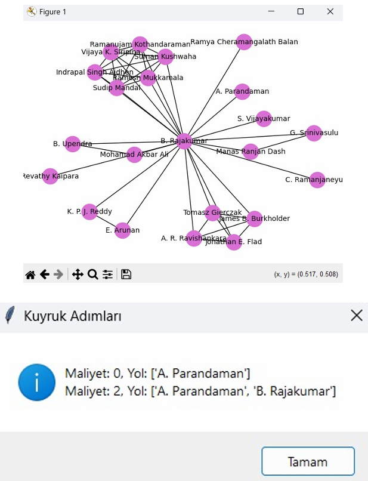

# Yazarlar ve Akademik İşbirliği Analizi Sistemi 📊👨‍💻🕸️

Bu proje, **Kocaeli Üniversitesi Bilgisayar Mühendisliği** Bölümü Programlama Laboratuvarı-I dersi kapsamında geliştirilmiş; akademik makalelerdeki yazar verilerini içeren bir veri setini işleyerek yazarlar arasındaki işbirliği ağını yönlendirilmesiz bir graf (graph) modeliyle çıkaran, analiz eden ve Tkinter arayüzü üzerinde dinamik olarak görselleştiren Python tabanlı bir veri yapıları ve analiz uygulamasıdır.

## 🚀 Projenin Amacı
Büyük bir akademik veri setinden (Excel/CSV) asenkron okuma yaparak yazarlar arasındaki ortak yayın ilişkilerini düğüm (node) ve kenar (edge) yapısıyla modellemektir. Sistem; yazarların makale sayılarına göre dinamik düğüm boyutu/rengi ölçeklemesi yapmayı, iki yazar arasındaki en kısa/en uzun işbirliği yollarını bulmayı ve bu ilişkileri gelişmiş veri yapısı algoritmalarıyla sorgulamayı amaçlar.

## 🛠️ Mimari ve Teknolojik Altyapı
* **Geliştirme Dili:** Python 3.x
* **Graf Modelleme & Analiz:** `networkx` (Akademik ilişkilerin düğüm ve kenar olarak haritalandırılması)
* **Arayüz Framework:** `tkinter` (Gelişmiş kullanıcı arayüzü, dinamik sol bilgilendirme paneli ve kontrol butonları)
* **Veri Görselleştirme:** `matplotlib` (Graf yapısının arayüz içine gömülerek canlı çizilmesi, Zoom In/Out araç çubuğu desteği)
* **Veri Yönetimi & Parsing:** `openpyxl` & `pandas` (Excel tabanlı ham veri setlerinin ayrıştırılması ve makale sayılarının hesaplanması)

## 🕹️ Öne Çıkan Sistem Fonksiyonları ve Algoritmalar
1. **Dinamik Graf Görselleştirme:** Yazarların toplam makale sayılarıyla orantılı olarak, daha fazla işbirliği yapan/makale yazan yazarlar büyük ve koyu renkli düğümlerle, daha az makale yazanlar ise küçük ve açık renkli düğümlerle otomatik olarak temsil edilir.
2. **Yazarlar Arası En Kısa Yol (Dijkstra Algoritması):** Kullanıcı tarafından ID'leri (ORCID) girilen iki yazar arasındaki en kısa akademik işbirliği zinciri Dijkstra algoritması kullanılarak hesaplanır ve harita üzerinde vurgulanarak sol panelde listelenir.
3. **En Uzun Yolun Bulunması (BFS Tabanlı):** Belirli bir yazardan başlayarak graf içerisindeki en uzak akademik bağlantı zinciri (en uzun yol) Genişlik Öncelikli Arama (BFS) tabanlı bir kuyruk mimarisiyle tespit edilir.
4. **İkili Arama Ağacı (BST) Oluşturma:** Seçilen bir yazarın işbirliği yaptığı tüm komşular, makale sayılarına göre manuel olarak tasarlanmış bir İkili Arama Ağacına (Binary Search Tree) yerleştirilir ve ağaç yapısı hiyerarşik olarak çıktı verilir.
5. **İşbirliği Yapan Yazarlar Kuyruğu:** Seçilen bir yazarın tüm işbirliği ortakları (komşuları), aralarındaki ortak makale sayılarına göre önceliklendirilerek bir Öncelikli Kuyruk (Priority Queue) yapısına eklenir ve sıralı şekilde listelenir.

## 📊 Graf Veri Modeli Tasarımı
Sistem, ilişkisel verilerden beslenen ağırlıklı ve yönlendirilmesiz bir graf yapısı üzerinde koşar:
* **Düğümler (Nodes):** Akademik yazarları temsil eder (Etiket olarak yazar isimleri veya ORCID bilgileri kullanılır).
* **Kenarlar (Edges):** İki yazarın ortak bir makalede (DOI) yer alması durumunda aralarında oluşan işbirliği bağını temsil eder. Kenar ağırlıkları, iki yazarın birlikte çıkardığı toplam ortak makale sayısına göre dinamik belirlenir.

## 📸 Ekran Görüntüleri

| 1. Algoritma Seçim ve Bilgi Ekranı | 2. Düğüm Ağırlığı ve Kenar Ağırlığı |
| :---: | :---: |
|  |  |

| 3. İki Yazar Arası Alt Graf | 4. En Kısa Yol Analizi |
| :---: | :---: |
|  | |

## 👥 Geliştiriciler
* **Merve Kübra ÖZTÜRK**
* **İclal ÜSTÜN**
